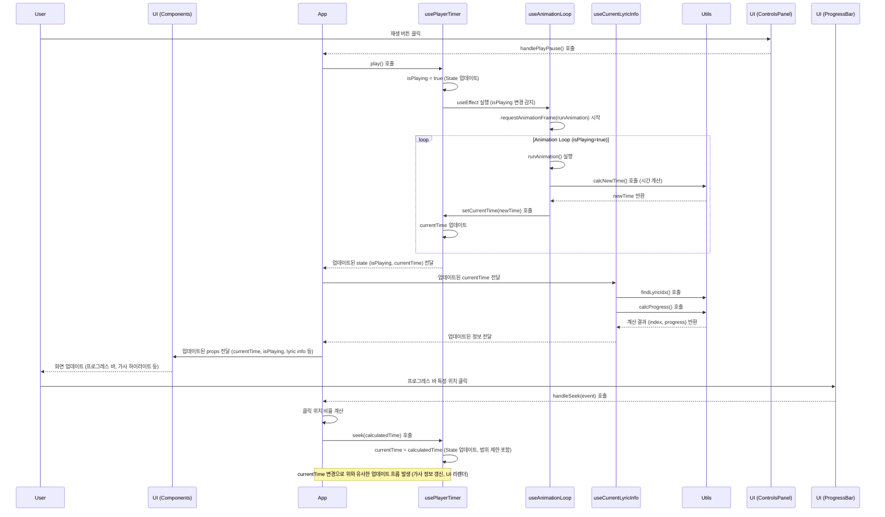

## ✅ 주요 태스크 (구현 기능)

*   **오디오 컨트롤:** 재생, 일시정지, 정지 기능 구현 (`ControlsPanel`, `usePlayerTimer`)
*   **재생 속도 조절:** Range Input을 이용한 재생 속도 변경 (0.25x ~ 3.0x) (`ControlsPanel`, `usePlayerTimer`)
*   **프로그레스 바:**
    *   현재 재생 시간 및 전체 시간 표시 (`ProgressBar`, `formatTime`)
    *   클릭 시 해당 시간으로 탐색(seek) 기능 구현 (`ProgressBar`, `App > handleSeek`, `usePlayerTimer > seek`)
    *   재생 진행률 시각화 (`ProgressBar`)
*   **가사 동기화 및 하이라이트:**
    *   현재 재생 시간에 맞는 가사 표시 (이전, 현재, 다음 라인) (`LyricsDisplay`, `useCurrentLyricInfo > findLyricIdx`)
    *   현재 가사 진행률에 따른 배경 하이라이트 효과 (`LyricsDisplay`, `useCurrentLyricInfo > calcProgress`)
*   **정확한 타이머 구현:** `requestAnimationFrame`과 `performance.now()`를 사용한 부드럽고 정확한 타이머 루프 구현 (`useAnimationLoop`)

## 🤔 문제 해결 방식 및 핵심 로직

이 프로젝트는 React의 상태 관리 및 컴포넌트 모델을 기반으로 하며, 복잡한 상태 로직과 UI를 분리하기 위해 커스텀 훅을 적극적으로 활용했습니다.

**1. 핵심 로직 분리 (커스텀 훅 & 유틸리티):**

*   **`usePlayerTimer`:** 재생 상태(`isPlaying`, `currentTime`, `playbackRate`)와 이를 제어하는 함수(`play`, `pause`, `stop`, `seek`, `setRate`)를 관리하는 핵심 훅입니다. 내부에 `useAnimationLoop`를 사용하여 타이머 로직을 통합 관리합니다.
*   **`useAnimationLoop`:** `requestAnimationFrame`을 사용하여 오디오 재생 시간을 부드럽게 업데이트하는 역할을 합니다. `performance.now()`를 통해 정확한 시간 경과(delta)를 계산하고, `playbackRate`를 반영하여 `currentTime`을 업데이트합니다. 재생 상태(`isPlaying`)에 따라 루프를 시작/중지합니다.
*   **`useCurrentLyricInfo`:** `currentTime`을 기반으로 현재 가사 인덱스(`findLyricIdx`)와 해당 가사의 진행률(`calcProgress`)을 계산하여 가사 동기화 및 하이라이트에 필요한 정보를 제공합니다.
*   **유틸리티 함수 (`utils/`):**
    *   `lyricTiming.ts`: 가사 데이터로부터 각 라인의 시작 시간(`timePoints`)과 총 재생 시간(`totalDuration`)을 계산하고, 현재 시간에 맞는 가사 인덱스를 찾는 순수 함수를 제공합니다.
    *   `lyricsHighlight.ts`: 현재 시간과 가사 타이밍 정보를 바탕으로 가사 하이라이트 진행률(0~100%)을 계산하는 순수 함수를 제공합니다.
    *   `timeUtils.ts`: 시간 포맷팅, `performance.now()` 리셋 등 시간 관련 보조 함수를 제공합니다.

**2. 상태 흐름 및 컴포넌트 상호작용 (시퀀스 다이어그램):**

다음은 사용자가 '재생' 버튼을 누르고 '프로그레스 바'를 클릭했을 때의 대략적인 로직 흐름입니다.

이 구조를 통해 각 부분의 책임을 명확히 하고, 상태 변경에 따른 업데이트 흐름을 예측 가능하게 만들었습니다.
