## 4.1 CSV 로드 & 초기 프레임 렌더링

### 4.1‑① CSV 다운로드 요청 → 응답 수신 (1 – 7)

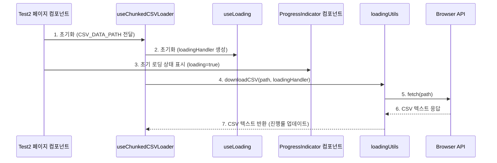

### 4.1‑② CSV 파싱 → 온도 데이터 추출 (8 – 12)

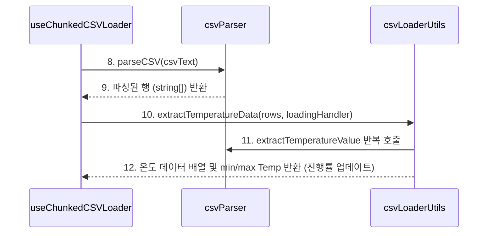

### 4.1‑③ 프레임 생성 & 로딩 완료 (13 – 16)

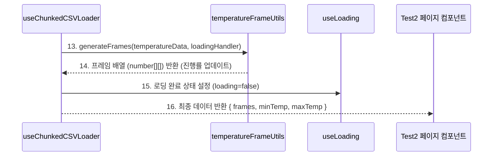

### 4.1‑④ 렌더러 초기화 & 첫 프레임 표시 (17 – 25)

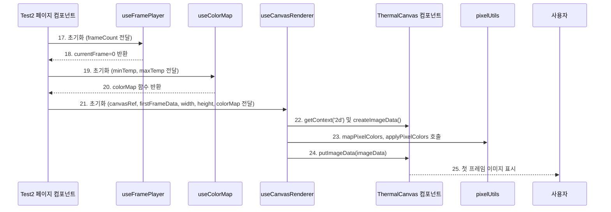

---

## 4.2 프레임 재생 컨트롤 (재생/정지)

### 4.2‑① Play 버튼 처리 & isPlaying 활성화 (1 – 4)

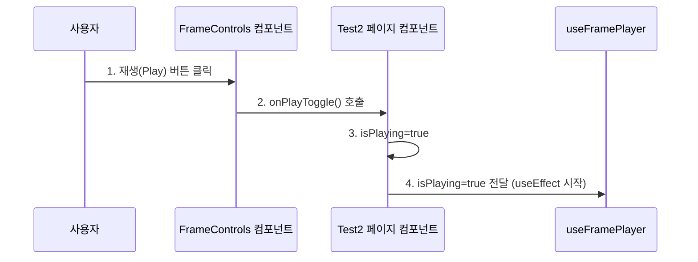

### 4.2‑② FPS 루프‑프레임 업데이트 & 렌더 (5 – 9)

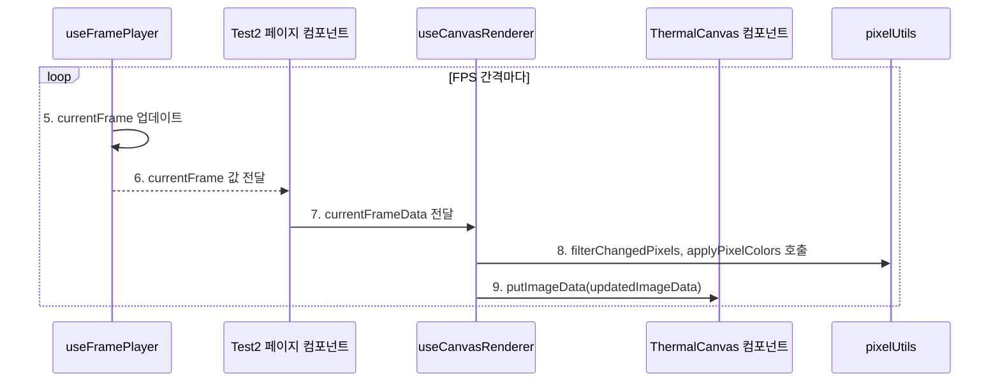

### 4.2‑③ Pause 버튼 처리 & 루프 정지 (10 – 13)

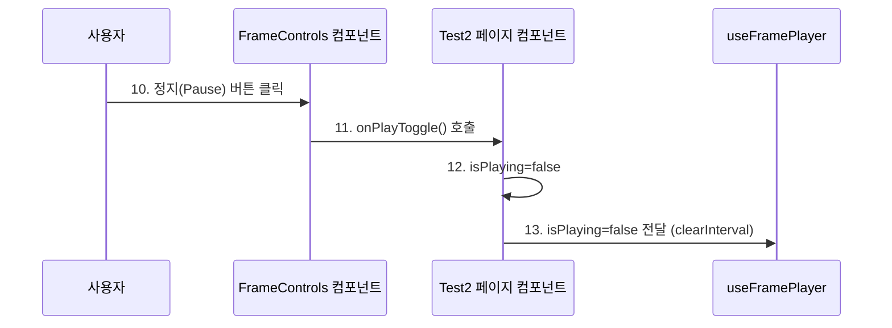

---

## 4.3 이미지 크롭 & 스냅샷 생성

### 4.3‑① Crop 모드 진입 (1 – 4)

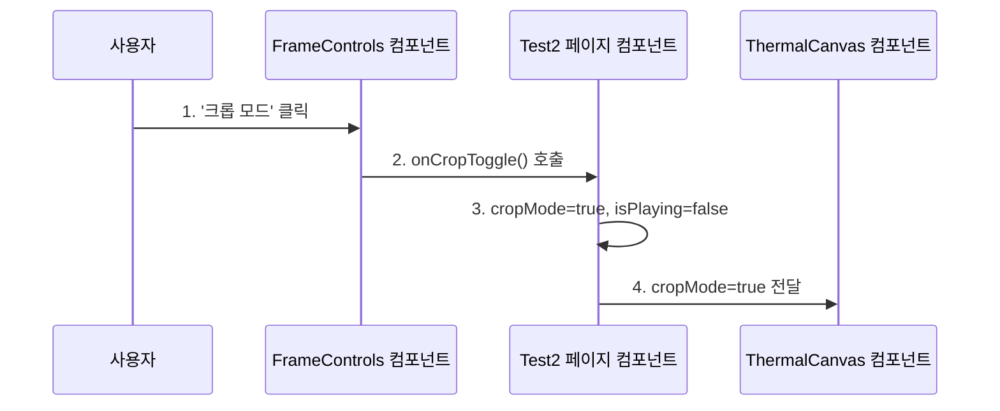

### 4.3‑② 드래그·영역 미리보기 (5 – 7)

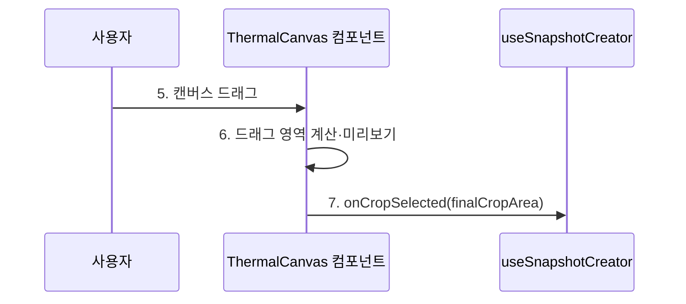

### 4.3‑③ 임시 캔버스 → 통계 계산 (8 – 13)

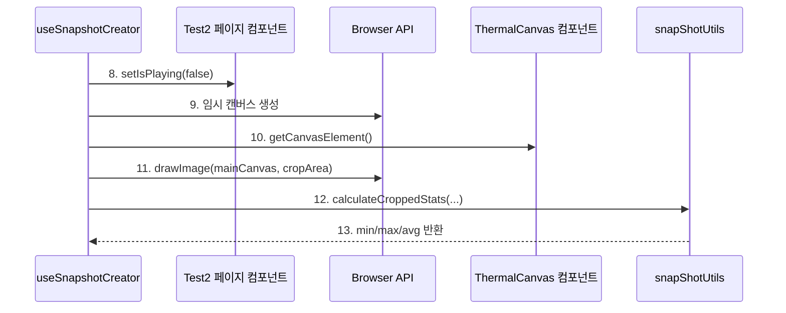

### 4.3‑④ DataURL 생성 & snapshots 업데이트 (14 – 21)

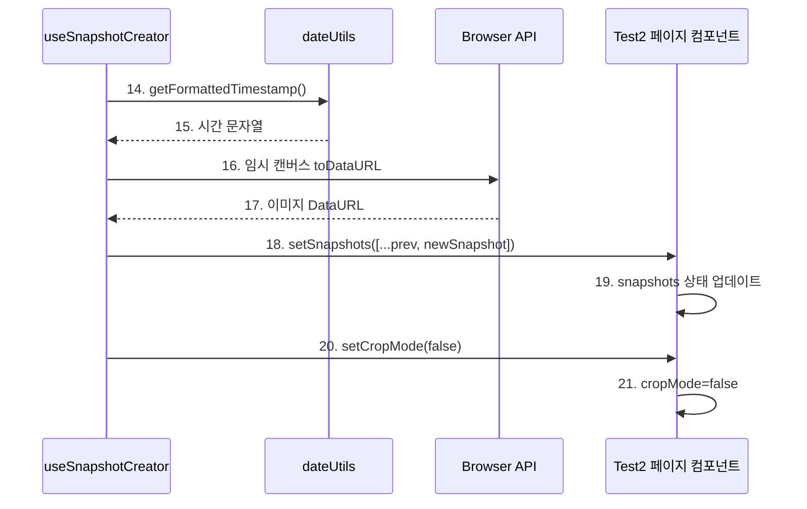

---

## 4.4 스냅샷 카드 다운로드

### 4.4‑① DOM → Canvas 렌더 (1 – 6)

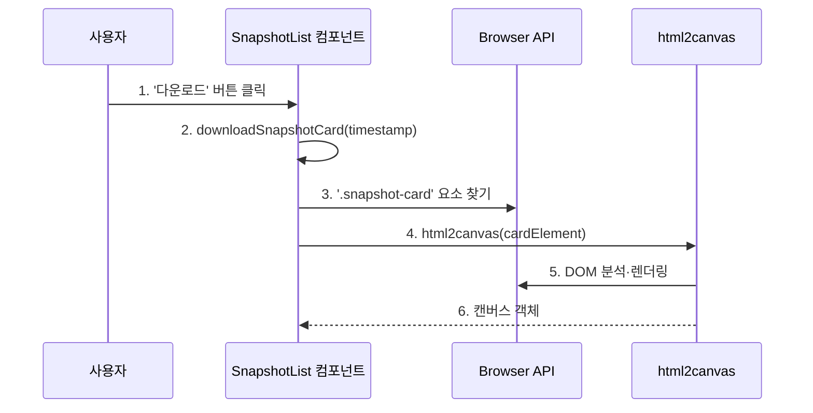

### 4.4‑② DataURL → PNG 저장 (7 – 10)

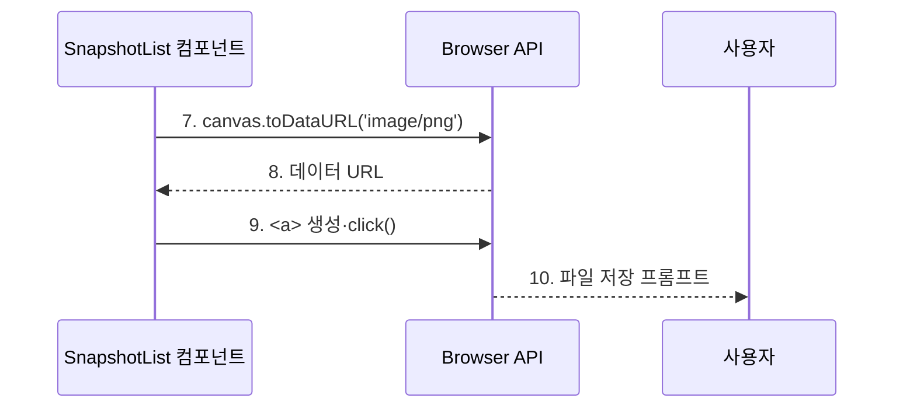

---

## 4.5 온도 데이터 차트 표시 (스냅샷 카드 내)

### 4.5‑① 스냅샷 전달 & 개별 차트 렌더 (1 – 2)

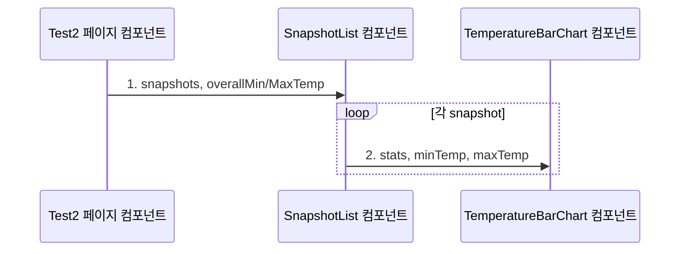

### 4.5‑② 막대 높이 계산 & 그리기 (3 – 4)

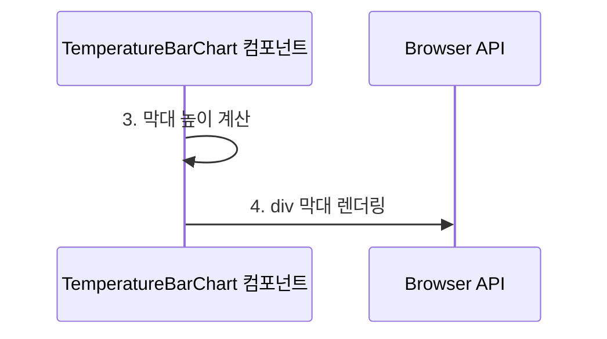
